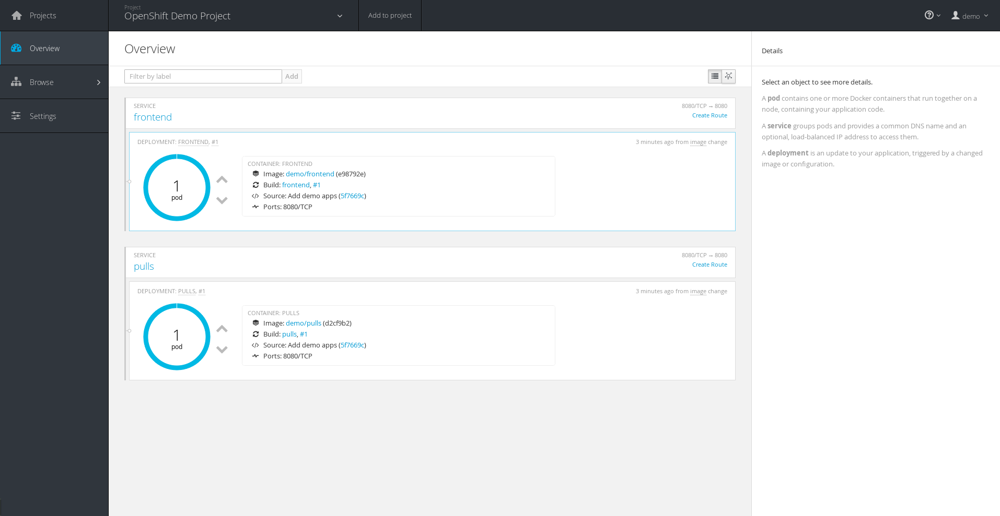
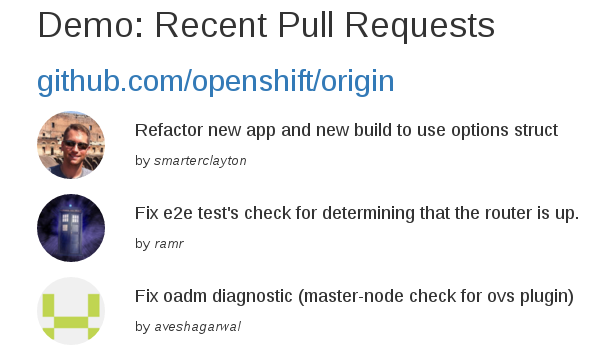

# pycon-sk-2016-demo

Demo code for my presentation in PyCon SK 2016.

## Instructions

The instructions below cover how to use the example webapps in this repository.
All examples are small Python applications based on the
[Bottle](http://bottlepy.org/) framework.

### Building images with a Dockerfile

To build a new Docker image using the [`docker
build`](https://docs.docker.com/engine/reference/commandline/build/) command and
the [`Dockerfile`](https://docs.docker.com/engine/reference/builder/) in the
`hello/` subdirectory, giving it the tag `hello`:

```
docker build -t hello hello/
```

When the build is complete, you can create/start a new container to run the demo
webapp:

```
docker run --rm -it -P hello
```

See more options for `docker run` in the [official
documentation](https://docs.docker.com/engine/reference/run/).

### Building with Source-To-Image

With the [Source-To-Image](https://github.com/openshift/source-to-image) tool,
instead of crafting your own Dockerfile, you provide source code and a *builder
image*, a Docker image that knows how to build other images.

```
s2i build hello/ openshift/python-34-centos7 hello-s2i
```

In the example above, we build a new image with tag `hello-s2i`, using the
`openshift/python-34-centos7` builder image and taking source code from the
`hello/` subdirectory.  
That builder image is officially supported by Red Hat, and publicly available
from DockerHub. It knows how to build Python applications and allows
customization of the build and run configuration through scripting.

You can download the `s2i` tool from the project [releases
page](https://github.com/openshift/source-to-image/releases).

The same process can be used to build the other examples in `frontend/` and
`pulls/`.

### Building and Deploying with OpenShift

[OpenShift](https://github.com/openshift/origin) supports both Source-To-Image
and regular Dockerfile-based builds natively. Installing and configuring an
OpenShift cluster is out-of-scope for this demo.

The examples `pulls` and `frontend` work together. The former calls the GitHub
API to fetch recent pull requests to the OpenShift project. The latter renders a
template showing data fetched from the former. They are a very simplistic
demonstration of two components that form a bigger system.

To create a build configuration that builds each of the components, and a
deployment configuration that deploys each of them, use the `oc new-app`
command:

```
oc new-app \
  centos/python-34-centos7~https://github.com/rhcarvalho/pycon-sk-2016-demo \
  --context-dir=pulls \
  --name=pulls
oc new-app \
  centos/python-34-centos7~https://github.com/rhcarvalho/pycon-sk-2016-demo \
  --context-dir=frontend \
  --name=frontend
```

After the first build and deployment of the apps is finished, the OpenShift Web
Console will look like this:



And accessing the `frontend` service will render:


